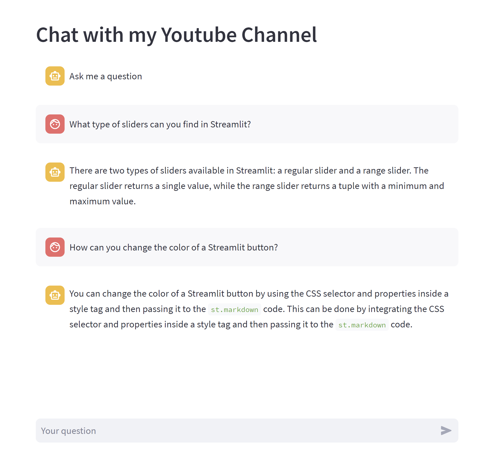

# Very Quick "Chat with a Youtube Playlist"



This app was built in 3 hours, it's functional but there are a lot of possible optimizations.

I didn't CLI-ify anything so folder input/output & Weaviate index are hardcoded at the beginning of each script. You should be able to edit `input_folder_path`, `output_folder_path` and `weaviate_index` without problems though.

## Prerequisites

I install in a conda environment (`conda create -n yt-chatbot python=3.9`) but feel free to use the package managers of your choice.

Install ffmpeg: `conda install -c conda-forge ffmpeg`

Install dependencices: `pip install -r requirements.txt`

Create accounts on [AssemblyAI](https://www.assemblyai.com/), [OpenAI](https://openai.com/) and [Weaviate](https://weaviate.io/).

Copy/paste API keys in a new `.env` and `.streamlit/secrets.toml` file, in the following format:

```
ASSEMBLYAI_API_KEY="XXX"
OPENAI_API_KEY="sk-XXX"
WEAVIATE_API_KEY="XXX"
WEAVIATE_URL="https://XXX.weaviate.network"
```

## Run

To run scripts, go in the `scripts` folder and run any one of them, `cd scripts; python <script_name>.py`

To run a Streamlit app, in the root folder run `streamlit run <script_name>.py`

The proper order should be:
1. Download audio from Youtube with `scripts/download_yt_playlist_audio.py`
2. Estimate the AssemblyAI price with `scripts/compute_total_hours.py`
3. Transcribe all audios in input folder with `scripts/transcribe_audio_files.py`
4. Build embeddings and store in Weaviate with `scripts/build_weaviate_llamaindex.py`
5. Explore Weaviate index in `st_weaviate_sandbox.py` or Chat with the documents in `streamlit_app.py`

## Weaviate Random notes just for me

Console: https://console.weaviate.cloud/query 

In headers in console, may need `{"X-OpenAI-Api-Key": "OPENAI_API_KEY"}`.

```graphql
{
  Get {
    LlamaIndex (limit: 2) {
      doc_id
      text
    }
  }
}
```

```graphql
{
  Get {
    LlamaIndex (
      limit: 2
      bm25: {
        query: "CSS"
      }
    ) {
      doc_id
      text
    }
  }
}
```

Llamaindex does not specify `'vectorizer': 'text2vec-openai'` in my class and it's immutable...so vectors seem to be produced by llamaindex. I suppose I need to use llamaindex to do vector search and that's why I can't vector search through Weaviate GraphQL :sad: .